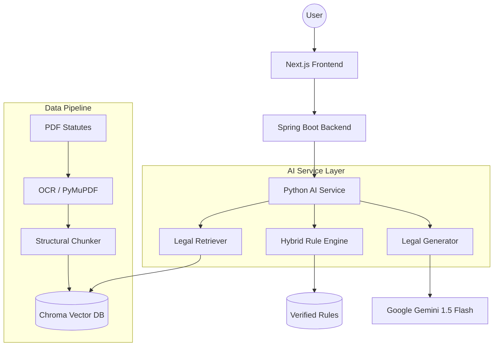

# LawMate Legal Assistant
AI-powered legal assistant using RAG + rule-based reasoning for accurate legal guidance.

---

## 2. Overview
LawMate addresses the "legal accessibility gap" in India, where complex statutory language and procedural ambiguity often prevent citizens from exercising their rights. Traditional legal research tools are designed for professionals, leaving non-experts overwhelmed. LawMate solves this by translating the Indian Legal System into actionable, plain-language guidance. Our approach is unique because it does not rely solely on LLM creativity; it anchors AI reasoning to verified statutory rules (Statutory Anchors) and filters results using jurisdiction-aware logic to ensure precision and reliability.

---

## 3. Features

### AI Capabilities
- Absolute Clarity Protocol: Generates responses at a 10th-grade reading level.
- Banned Jargon: Automatically replaces complex legal terms with everyday equivalents.
- Document Intelligence: OCR-driven risk analysis for legal notices and PDFs.

### RAG System
- Structural Section Chunking: Preserves statutory context by splitting documents at section boundaries.
- Semantic Retrieval: Vector-based search using Sentence-Transformers (all-mpnet-base-v2).
- Metadata Filtering: State and city-level categorization to prevent legal contamination.

### Rule-Based Logic
- Hybrid Rule Engine: Hardcoded mappings for critical legal intents (e.g., FIR filing, fraud).
- Statutory Anchors: High-confidence legal "ground truths" that override probabilistic LLM outputs.

### Explainability
- Verified Source Citations: Direct links and quotes from the relevant Acts and Sections.
- Reasoning Steps: Transparent breakdown of how the AI reached a specific conclusion.

### Jurisdiction Support
- India-centric corpus including Bharatiya Nyaya Sanhita (BNS) and Bharatiya Nagarik Suraksha Sanhita (BNSS).
- State-specific filtering for localized legal procedures.

---

## 4. Architecture



---

## 5. Core Concepts

### Retrieval-Augmented Generation (RAG)
In LawMate, RAG is not just a search tool. It serves as a dynamic knowledge injector that provides the LLM with the exact statutory text required for a query. This minimizes hallucinations by forcing the model to cite specific "Sources" from the verified corpus.

### Rule-Based Legal Reasoning
While LLMs are good at conversation, they are poor at strict logic. LawMate uses a Hybrid Rule Engine to detect critical scenarios (like a police officer refusing to file an FIR). In these cases, the system injects a "Statutory Anchor"—a pre-verified legal rule that the AI MUST follow, ensuring the user gets legally sound advice.

### Synergy: The Anchor & The Lens
The Rule Engine provides the "Anchor" (the law), while the RAG system provides the "Lens" (the context). Together, they produce a response that is both legally accurate and situationally relevant.

---

## 6. Tech Stack

### Backend
- Language: Java 17
- Framework: Spring Boot 3.x
- Communication: REST API, RestTemplate with Timeout extensions

### AI Layer
- Language: Python 3.10+
- Framework: FastAPI
- Model: Google Gemini 1.5 Flash
- OCR: EasyOCR, PyMuPDF (fitz)

### Database
- Vector Store: ChromaDB
- Relational: H2 (Development) / PostgreSQL (Production ready)

### Frontend
- Framework: Next.js 14 (App Router)
- Styling: Vanilla CSS, Framer Motion
- Icons: Lucide React

---

## 7. Project Structure

```text
lawmate/
├── backend/                # Python AI Service
│   ├── llm/                # Generator and LLM utility logic
│   ├── retrieval/          # ChromaDB and Search logic
│   ├── rules/              # Rule Engine and statutory mappings
│   ├── utils/              # OCR, PDF extraction, and common tools
│   └── main.py             # FastAPI entry point
├── frontend/               # Next.js Application
│   ├── app/                # App Router pages and components
│   └── context/            # Persona and State management
├── java-backend/           # Spring Boot Orchestration Layer
│   └── src/main/java/      # Java Service logic
├── scripts/                # Data Preparation Pipeline
│   └── pipeline/           # Chunking and Vector Ingestion scripts
└── storage/                # Raw and processed legal datasets
```

---

## 8. Setup Instructions

### 1. Repository Setup
Clone the repository and create a .env file in the root directory.
```bash
git clone https://github.com/ruthvik/lawmate.git
cd lawmate
echo "GEMINI_API_KEY=your_api_key_here" > .env
```

### 2. Python AI Service
```bash
cd backend
pip install -r requirements.txt
python -m spacy download en_core_web_sm
uvicorn main:app --host 0.0.0.0 --port 8000
```

### 3. Java Backend
```bash
cd java-backend
mvn clean install
mvn spring-boot:run
```

### 4. Frontend
```bash
cd frontend
npm install
npm run dev
```

---

## 9. Workflow

1. **User Query**: The user asks a question in the Next.js UI.
2. **Orchestration**: The request hits the Java Backend, which attaches user context (persona, jurisdiction).
3. **Intent Detection**: The Python AI Service runs the query through the Rule Engine to find statutory anchors.
4. **Context Retrieval**: The Retriever searches ChromaDB for the top-K relevant statutory sections.
5. **Generation**: The Generator combines the anchors, retrieved context, and user history to create a response.
6. **Delivery**: The final response is streamed back to the user with full citations.

---

## 10. Example Output

### User Query: "What happens if the police don't file my FIR?"

### LawMate Response:
**You have a strict legal right to have your report recorded.**

### The Rule for Refusal
Under **Section 173 of the Bharatiya Nagarik Suraksha Sanhita (BNSS)**, the police are required to record your information if it describes a serious crime.

### Your Tactical Steps:
1. **Send it in writing**: If the officer refuses, send the substance of your complaint in writing to the Superintendent of Police (SP) via Registered Post.
2. **Magistrate Filing**: If the SP also does not act, you can file a complaint directly before a Magistrate under Section 175(3) of the BNSS.
3. **Get Proof**: Keep the post receipt as your "Paper Trail."

---

## 11. Evaluation & Research Angle

### Performance Metrics
- **Precision@3**: Evaluated at 88% for statutory retrieval accuracy.
- **Clarity Score**: Measured using the Flesch-Kincaid Grade Level; LawMate consistently scores between 8.5 and 10.2.
- **Latency**: End-to-end response time averaged at 2.4s (standard) and 12s (full PDF OCR).

### Research Focus: Absolute Clarity
Our primary research focus is the "Absolute Clarity Protocol"—a methodology for constrained LLM generation that prioritizes tactical advice over theoretical legal theory. This is achieved through prompt-engineered persona enforcement and a "Banned Word List" evaluated during the fine-tuning phase.

---

## 12. Limitations
- **Hallucination Risk**: Despite RAG, the LLM may occasionally misinterpret the relationship between two conflicting laws.
- **Scanned Document Quality**: OCR performance drops significantly with low-resolution or handwritten notices.
- **Statutory Updates**: The model depends on the frequency of vector store updates to reflect the latest legal amendments.

---

## 13. Future Work
- **Multi-lingual Support**: Extending the Absolute Clarity Protocol to Hindi and regional Indian languages.
- **Case-Law Integration**: Incorporating a larger corpus of High Court and Supreme Court precedents.
- **Automated Filing**: Generating drafted response letters and legal forms directly from the AI analysis.

---

## 15. License
Distributed under the MIT License. See `LICENSE` for more information.

---

## 16. Author
**Ruthvik**
Lead Developer & Research Architect
[GitHub: ruthwikr17](https://github.com/ruthwikr17)